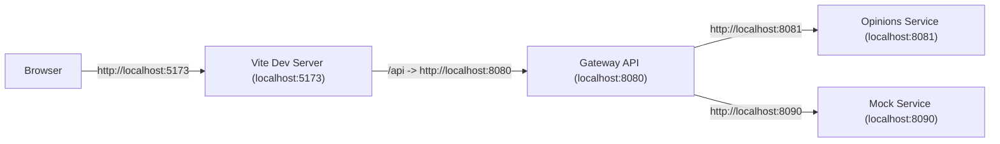
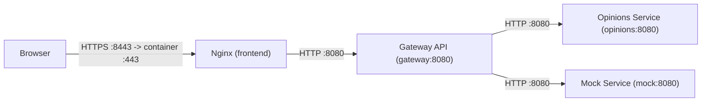
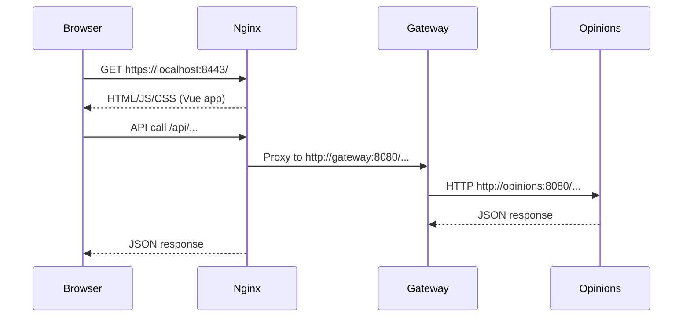
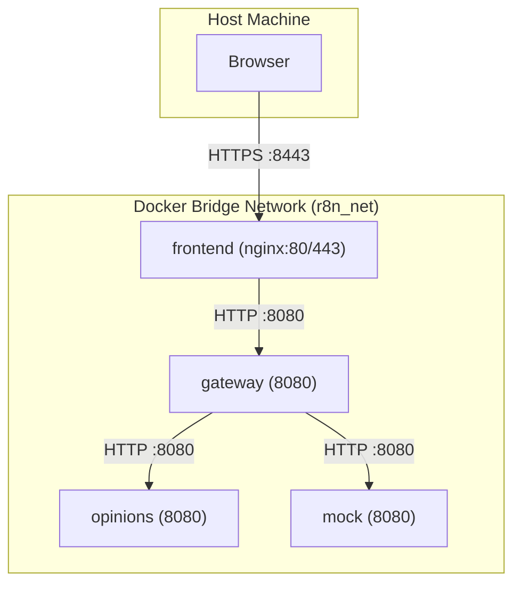

# Docker Architecture (HTTPS at the Edge + Internal HTTP)

This document explains the Docker networking layout, TLS termination, and how the current local Docker setup uses HTTP on the private network.

## Core Idea

- HTTPS is required at the **edge** (browser <-> Nginx) to protect user traffic.
- Inside the Docker network, services use HTTP in the current local setup.
- Nginx terminates edge TLS and forwards requests to the gateway.
- The gateway calls backend services over HTTP while still using the same internal ports.

## High-Level Flows

Local dev (no Docker):

Local production (Docker):

## Runtime API Sequence (Nginx + Gateway)

## Dev vs Runtime

Dev (Vite):
- Browser talks directly to the Vite dev server at `http://localhost:5173`.
- Vite proxies `/api` to the gateway at `http://localhost:8080`.
- The gateway reaches services on `localhost:8081` and `localhost:8090`.
- No Nginx involved.

Runtime (local production):
- Browser talks to Nginx over `https://localhost:8443` by default.
- `http://localhost:8088` redirects to HTTPS.
- Nginx serves static assets and proxies `/api` to the gateway at `http://gateway:8080`.
- The gateway reaches services by name on `http://opinions:8080` and `http://mock:8080`.
- This mirrors a production edge setup with TLS termination at the edge and simple HTTP on the private network.

## Ports by Mode

Local dev (no Docker):
- `gateway` -> `localhost:8080`
- `opinions` -> `localhost:8081`
- `mock` -> `localhost:8090`

Local production (Docker):
- browser -> `localhost:8088` (HTTP) and `localhost:8443` (HTTPS)
- `gateway` -> `localhost:8080` from the host, `gateway:8080` inside Docker
- `opinions` -> `opinions:8080` inside Docker only
- `mock` -> `mock:8080` inside Docker only

Inside Docker, containers are isolated. Multiple services can use the same port because each service has its own hostname.
From the host machine, only published ports are reachable. In this setup:
- `localhost:8088` maps to `frontend:80`
- `localhost:8443` maps to `frontend:443`
- `localhost:8080` maps to `gateway:8080`

## Docker Network View

## Why HTTPS at the Edge

- The browser is outside the Docker network, so traffic must be encrypted.
- The Docker bridge network is isolated and private to the host machine.
- The private Docker network keeps the internal traffic simple in local development.
- Internal TLS can be added later if needed, but it adds certificate management complexity.

## Notes

- If deployed to a public environment, internal TLS can be added as well.
- For local production, TLS at the edge is mandatory; internal service traffic stays on HTTP in the current setup.
- On rootless Docker, host ports `80` and `443` may not be bindable. This branch uses `8088` and `8443` by default for that reason.
