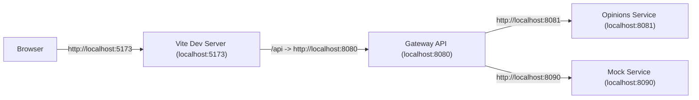
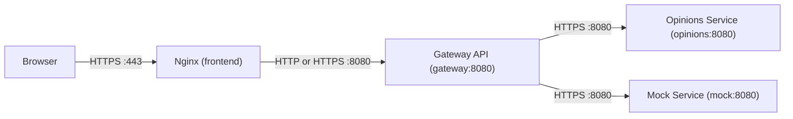
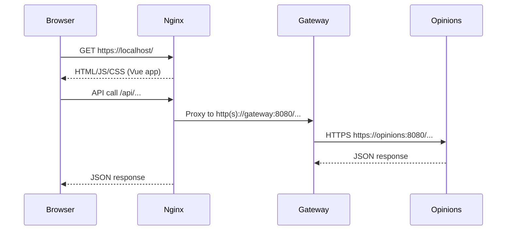
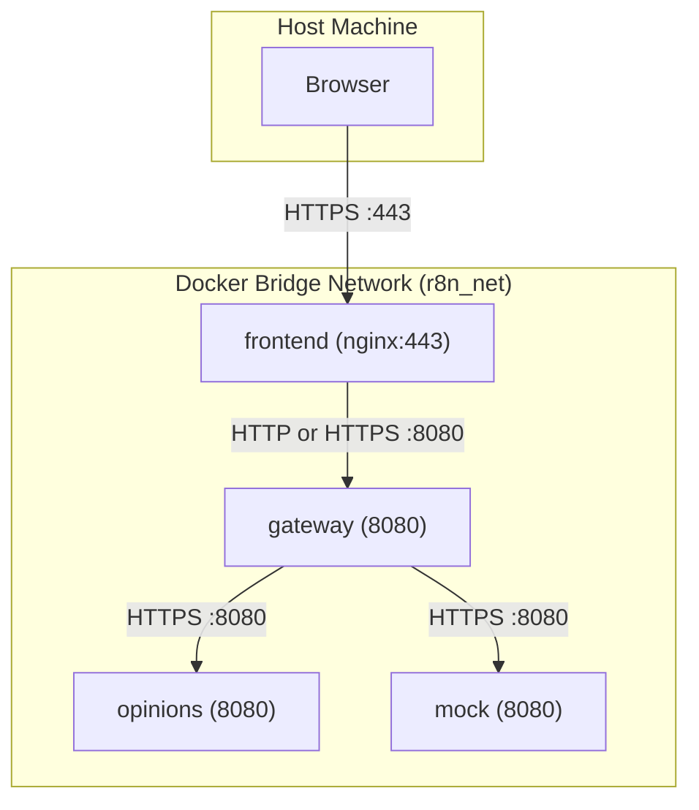

# Docker Architecture (HTTPS at the Edge + Internal TLS)

This document explains the Docker networking layout, TLS termination, and how internal service-to-service HTTPS fits in.

## Core Idea

- HTTPS is required at the **edge** (browser <-> Nginx) to protect user traffic.
- Inside the Docker network, services can use **HTTPS** as well when internal TLS is enabled.
- Nginx terminates edge TLS and forwards requests to the gateway.
- The gateway can call backend services over HTTPS while still using the same internal ports.

## High-Level Flows

Local dev (no Docker):

Local production (Docker):

## Runtime API Sequence (Nginx + Gateway)

## Dev vs Runtime

Dev (Vite):
- Browser talks directly to the Vite dev server at `http://localhost:5173`.
- Vite proxies `/api` to the gateway at `http://localhost:8080`.
- The gateway reaches services on `localhost:8081` and `localhost:8090`.
- No Nginx involved.

Runtime (local production):
- Browser talks to Nginx over `https://localhost`.
- Nginx serves static assets and proxies `/api` to the gateway at `http(s)://gateway:8080`.
- The gateway reaches services by name on `https://opinions:8080` and `https://mock:8080` when internal TLS is enabled.
- This mirrors a production edge setup with TLS termination and optional internal TLS.

## Ports by Mode

Local dev (no Docker):
- `gateway` -> `localhost:8080`
- `opinions` -> `localhost:8081`
- `mock` -> `localhost:8090`

Local production (Docker):
- `gateway` -> `gateway:8080` (HTTP or HTTPS)
- `opinions` -> `opinions:8080` (HTTPS)
- `mock` -> `mock:8080` (HTTPS)

Inside Docker, containers are isolated. Multiple services can use the same port because each service has its own hostname.
From the host machine, only published ports are reachable. In this setup:
- `localhost:8080` maps to `gateway:8080`

## Docker Network View

## Why HTTPS at the Edge (and Sometimes Inside)

- The browser is outside the Docker network, so traffic must be encrypted.
- The Docker bridge network is isolated and private to the host machine.
- Internal HTTPS can be enabled to mirror production and satisfy security requirements.
- Internal TLS adds certificate management, but it makes service-to-service traffic encrypted too.

## Notes

- If deployed to a public environment, internal TLS can be added as well.
- For local production, TLS at the edge is mandatory; internal TLS is optional but supported.
