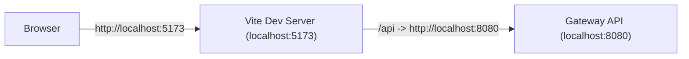
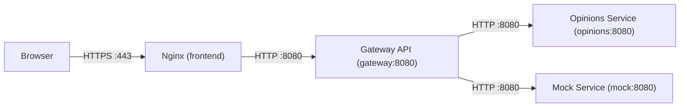

# Frontend Guide (Dita)

This guide explains the frontend stack, dependencies, build and dev workflows, local production, test cases, expected results, and troubleshooting.

## Stack

- Vue 3 application built with Vite
- Tailwind CSS
- Nginx for local production serving and API proxying
- Gateway API behind `/api`

## Dependencies

- Node.js `>=22.12.0` (pinned in `frontend/.nvmrc`)
- npm (recommended `npm 10+`)
- Docker + Docker Compose for local production

Node version management:

- `nvm` stands for Node Version Manager
- It keeps the same Node version across the team and CI (Continuous Integration: automated builds/tests on push/PR)

Install `nvm` (macOS/Linux):

1. `curl -o- https://raw.githubusercontent.com/nvm-sh/nvm/v0.40.3/install.sh | bash`
2. Restart the terminal
3. `cd frontend`
4. `nvm install`
5. `nvm use`

Node version check:

- `make frontend-check-node`
- If the version is too old, it prints a fix command using `nvm`

## Build (Production Bundle)

- Command: `make frontend-build`
- Output: `frontend/dist`
- Purpose: optimized static assets for Nginx

Clean build artifacts:

- `make frontend-clean` (removes `frontend/dist` and `frontend/node_modules/.vite`)
- `make frontend-clean-all` (also removes `frontend/node_modules` and generated certs)

## Dev (Vite)

- Command: `make frontend-dev`
- URL: `http://localhost:5173`
- Proxy: `/api` -> `http://localhost:8080` (gateway)
- No Nginx involved

Dev flow:

## Production (Local)

Nginx serves the built frontend and proxies `/api` to the gateway inside the Docker network.
HTTPS is terminated at Nginx using a self-signed certificate generated by OpenSSL.

Generate certs (auto-run on `make docker-up` if missing):

- `make frontend-cert`

Start the stack:

- `make docker-up`

Open in browser:

- `https://localhost`

Local production flow:

Rebuild containers:

- `make docker-down && make docker-build && make docker-up`
- if certs were cleaned, run `make frontend-cert` before starting

## Tests

Unit tests:

- `make frontend-test-unit`

E2E tests:

- `make frontend-test-e2e`

## What to Test and Expected Results

Dev:

- Vite prints a ready message similar to:
  - `VITE vX.X.X ready in X ms`
  - `Local: http://localhost:5173/`
- The app loads at `http://localhost:5173`
- API calls through `/api` return JSON from the gateway

Local production:

- `https://localhost` loads the app
- `/api/...` routes are proxied by Nginx to the gateway
- `http://localhost` redirects to HTTPS

Gateway root:

- `http://localhost:8080/` returns `404` (expected). The gateway is API-only.

## Troubleshooting

- `vite: command not found` -> run `make frontend-install`
- `https://localhost` shows a warning -> self-signed cert; proceed for local use
- `https://localhost` returns 502 -> gateway container is not running
- Ports 80/443 in use -> change `FRONTEND_HTTP_HOST_PORT` / `FRONTEND_HTTPS_HOST_PORT` in `deployment/config/docker.env`
- `http://localhost:8080/` returns 404 -> expected; use real API routes

## Configuration Locations

- Vite proxy: `frontend/vite.config.ts`
- Vite env vars: `frontend/.env.development` and optional `frontend/.env.production`
- Nginx config: `deployment/frontend/nginx.conf`
- Docker env: `deployment/config/docker.env`
- Cert generation: `scripts/gen-frontend-cert.sh`
