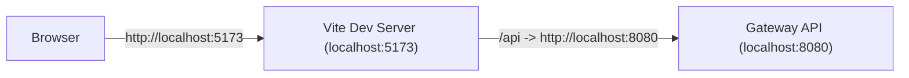
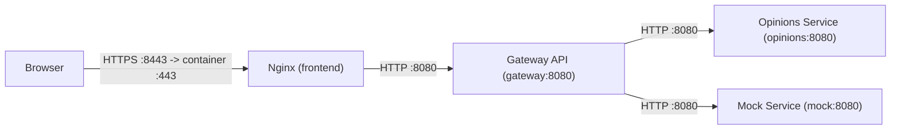

# Frontend Guide (Dita)

This guide explains the frontend stack, dependencies, build and dev workflows, local production, test cases, expected results, and troubleshooting.

## Stack

- Vue 3 application built with Vite
- Tailwind CSS
- Nginx for local production serving and API proxying
- Gateway API behind `/api`

## Dependencies

- Node.js `>=22.13.0` (pinned in `frontend/.nvmrc`)
- npm (recommended `npm 10+`)
- Docker + Docker Compose for local production

Node version management:

- `nvm` stands for Node Version Manager
- It keeps the same Node version across the team and CI (Continuous Integration: automated builds/tests on push/PR)

Install `nvm` (macOS/Linux):

1. `curl -o- https://raw.githubusercontent.com/nvm-sh/nvm/v0.40.3/install.sh | bash`
2. Restart the terminal
3. `cd frontend`
4. `nvm install`
5. `nvm use`

Node version check:

- `make frontend-check-node`
- If the version is too old, it prints a fix command using `nvm`

Session note:

- `nvm use` applies only to the current terminal session.
- New terminals may fall back to the system Node version unless `nvm use` is run again.
- The system Node version is not changed because it can affect other projects and often requires admin rights.

Why Node >= 22.13.0:

- The project pins this version in `frontend/.nvmrc` and `frontend/package.json` for consistency.
- Some lint tooling (ESLint dependencies like `eslint-visitor-keys`) declares support starting from Node 22.13.
- These are development tools only; the runtime app is unaffected.

Frontend install (with Playwright browsers):

- `make frontend-install-all`

## Build (Production Bundle)

- Command: `make frontend-build`
- Output: `frontend/dist`
- Purpose: optimized static assets for Nginx

Clean build artifacts:

- `make frontend-clean` (removes `frontend/dist` and `frontend/node_modules/.vite`)
- `make frontend-clean-all` (also removes `frontend/node_modules` and generated certs)

## Dev (Vite)

- Command: `make frontend-dev`
- URL: `http://localhost:5173`
- Proxy: `/api` -> `http://localhost:8080` (gateway)
- No Nginx involved

Dev flow:

## Production (Local)

Nginx serves the built frontend and proxies `/api` to the gateway inside the Docker network.
HTTPS is terminated at Nginx using a self-signed certificate generated by OpenSSL.
With the current `deployment/config/docker.env`, the host ports are `8088` (HTTP) and `8443` (HTTPS).
These defaults work with rootless Docker and can be changed if needed.

Generate certs (auto-run on `make docker-up` if missing):

- `make frontend-cert`

Start the stack:

- `make docker-up`

Open in browser:

- `https://localhost:8443`
- `http://localhost:8088` redirects to HTTPS

Local production flow:

Rebuild containers:

- `make docker-down && make docker-build && make docker-up`
- if certs were cleaned, run `make frontend-cert` before starting

Note: `make docker-up` builds the frontend bundle on the host (using `make frontend-build`) and then builds the Nginx image from `frontend/dist`. This keeps the Docker image smaller and avoids running `npm ci` inside the Docker build.

Internal network note:

- The current Docker configuration uses `INTERSERVICE_PROTOCOL=http`, so the gateway calls backend services over `http://opinions:8080` and `http://mock:8080`.
- Internal HTTPS can be added later if you want to mirror a stricter production setup.

## Tests

Unit tests:

- `make frontend-test-unit`

E2E tests:

- `make frontend-test-e2e`

E2E meaning:

- End-to-end tests run the app in a real browser and verify full user flows.
- They cover UI + API integration and catch issues that unit tests cannot.

Note: E2E tests require Playwright browsers. `make frontend-install-all` downloads them.
On macOS 13 (arm64), Playwright does not support WebKit. In that case, run only Chromium/Firefox or disable the WebKit project.

Test output notes:

- `npm warn deprecated glob@10.5.0` is expected (transitive dependency) and does not affect test results.
- `vitest` runs in watch mode by default. To force a single run, use `cd frontend && npm run test:unit -- --run`.

## What to Test and Expected Results

Dev:

- Vite prints a ready message similar to:
  - `VITE vX.X.X ready in X ms`
  - `Local: http://localhost:5173/`
- The app loads at `http://localhost:5173`
- API calls through `/api` return JSON from the gateway

Local production:

- `https://localhost:8443` loads the app
- `/api/...` routes are proxied by Nginx to the gateway
- `http://localhost:8088` redirects to HTTPS

Gateway root:

- `http://localhost:8080/` returns `404` (expected). The gateway is API-only.

## Troubleshooting

- `vite: command not found` -> run `make frontend-install`
- `https://localhost:8443` shows a warning -> self-signed cert; proceed for local use
- `https://localhost:8443` returns 502 -> gateway container is not running
- On rootless Docker, host ports `80` and `443` may fail to bind. Use unprivileged host ports such as the current `8088` / `8443`, or change `FRONTEND_HTTP_HOST_PORT` / `FRONTEND_HTTPS_HOST_PORT` in `deployment/config/docker.env`
- `http://localhost:8080/` returns 404 -> expected; use real API routes

## Configuration Locations

- Vite proxy: `frontend/vite.config.ts`
- Vite env vars: `frontend/.env.development` and optional `frontend/.env.production`
- Nginx config: `deployment/frontend/nginx.conf`
- Docker env: `deployment/config/docker.env`
- Cert generation: `scripts/gen-frontend-cert.sh`
